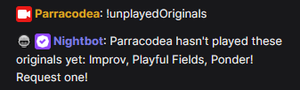

# Streamer Songlist Integration

Want to create a Nightbot command that can check your Streamer Songlist for you? Follow this guide to learn how!


You can [demo the command in Twitch Chat](https://www.twitch.tv/parracodea), if you want. The following commands are available:

- Request a song
  - `!sr <name of song>`
  - Or [request a song directly in my Streamer Songlist](https://www.streamersonglist.com/t/parracodea/songs)
- `!markSongAsPlayed` - Mark a song as played
- `!unplayedOriginals` - Check what originals have been played

# Table of Contents

- [Streamer Songlist Integration](#streamer-songlist-integration)
- [Table of Contents](#table-of-contents)
- [Intro](#intro)
  - [TL;DR](#tldr)
  - [What??? Help!](#what-help)
- [Find your category id](#find-your-category-id)
- [Find the IDs of songs you want Nightbot to ignore](#find-the-ids-of-songs-you-want-nightbot-to-ignore)
- [Creating the Nightbot Command](#creating-the-nightbot-command)
  - [Variables](#variables)
    - [Variable: SONGS\_TO\_IGNORE\_HERE](#variable-songs_to_ignore_here)
    - [Variable: STREAMER\_SONGLIST\_API\_URL](#variable-streamer_songlist_api_url)
    - [Messages sent by Nightbot](#messages-sent-by-nightbot)
      - [Variable: WHEN\_THERE\_ARE\_UNPLAYED\_SONGS](#variable-when_there_are_unplayed_songs)
      - [Variable: WHEN\_ALL\_SONGS\_ARE\_PLAYED](#variable-when_all_songs_are_played)
  - [Pasting the command into Nightbot](#pasting-the-command-into-nightbot)
    - [Demo](#demo)

# Intro

Sometimes, it's handy to know what original songs haven't been played yet this stream, but opening Streamer Songlist and sorting by `Last Played` isn't too convenient. This command can take care of that for you! And, Nightbot will only looks at the songs you have marked as "active", so if you hide some songs, there's no need to update the command.

For this example, I created a [sample Streamer Songlist](https://www.streamersonglist.com/t/parracodea) so that you have a concrete example to follow along with. In the links, you can replace `parracodea` with your Streamer Songlist username.

_⚠️ This command uses Streamer Songlist's API. As a general warning, you should be careful when using APIs, as accidentally revealing API Tokens (like Stream Keys) can give hackers access to your account. That being said, this command only uses the public section of the API, meaning that you **don't** need to be signed in to access the API, which will mitigate the risk!_

After this following this guide, you could build upon this sample command and have Nightbot do other fun things with Streamer Songlist's API, like check what songs are currently in the queue!

## TL;DR

- You can use Nightbot's `$(urlfetch json ` to pull results from an API that returns JSON.
- Streamer Songlist has a public API. They have documentation available at [https://api.streamersonglist.com/docs/](https://api.streamersonglist.com/docs/).
- Use the [`GET /v1/streamers/{streamerId}` endpoint](https://api.streamersonglist.com/docs/#/streamers/StreamerController_getStreamer) to find your Category ID.
- Use the [`GET /v1/streamers/{streamerId}/songs` endpoint](https://api.streamersonglist.com/docs/#/songs/SongsController_getSongs) to get the Song IDs of any songs you want to ignore.
- Use the [`/v1/streamers/{streamerId}/songs` endpoint](https://api.streamersonglist.com/docs/#/songs/SongsController_getSongs) to get a list of songs for the category.
- Use Nightbot's `$(eval )` to use Javascript to filter the results.

## What??? Help!

If this sounds a bit complicated or you get stuck somewhere, I'm happy to help. Email me at `parracodea =at= gmail =dot= com`.

If this worked successfully on your stream, I'd love to know too! :)

# Find your category id

First, we need to find the ID of the category we want Nightbot to look at. The [Streamer Songlist API's `GET /v1/streamers/{streamerId}` endpoint](https://api.streamersonglist.com/docs/#/streamers/StreamerController_getStreamer) can give us a list of categories and their respective IDs.

In your web browser (optionally in a private/incognito window), go to `https://api.streamersonglist.com/v1/streamers/YOUR_STREAMER_SONGLIST_USERNAME_HERE`.

- Replace `YOUR_STREAMER_SONGLIST_USERNAME_HERE` with your username
- e.g. `https://api.streamersonglist.com/v1/streamers/parracodea`

You should see a page that looks something like this:


Scroll down and find the array named `attributes`, around line 49. In the screenshot, this is the red box. For my example, I'm looking for Nightbot to report on the songs from the category named `Originals`, so I'll look for a section that says `"name": "Originals"`. If your category was called `Instrumentals`, then you'd look for `"name": "Instrumentals"`. In the screenshot, this is the green box. For me, it happens to be the first item in the array.

_Doing a "Find in Page" `Control + F` would work as well, and may be easier._


You'll need the category ID, which can be found right above the `name` field. For my `Originals` category, the ID is `61765`. Record this number for later.

# Find the IDs of songs you want Nightbot to ignore

In my song list, I have a song called `Any Original`. I want Nightbot to ignore this song in the command output, so I'll need this song's ID. If you don't have any songs in the category that you want Nightbot to ignore, you can skip this step.

The [Streamer Songlist API's `GET /v1/streamers/{streamerId}/songs` endpoint](https://api.streamersonglist.com/docs/#/songs/SongsController_getSongs) can give us a list of songs and their IDs. 

In your web browser, go to `https://api.streamersonglist.com/v1/streamers/YOUR_STREAMER_SONGLIST_USERNAME_HERE/songs?size=100&current=0`.

- Replace `YOUR_STREAMER_SONGLIST_USERNAME_HERE` with your username
- e.g. `https://api.streamersonglist.com/v1/streamers/parracodea/songs?size=100&current=0`

You should see something like this:


Find your song and look at the `id` field to get the Song ID. For my `Any Original` song, the Song ID is `4336479`.

_If you cant find your song:_

- This API endpoint only shows "Active" songs. "Inactive" songs will not be shown.
- This API endpoint only shows 100 songs at a time, so you may have to check the next page if you have more than 100 songs in your song list. To view the next page, increase the number in `current=` in the url and search again, until you find your song.
    - e.g.
        - `https://api.streamersonglist.com/v1/streamers/YOUR_STREAMER_SONGLIST_USERNAME_HERE/songs?size=100&current=0`
        - `https://api.streamersonglist.com/v1/streamers/YOUR_STREAMER_SONGLIST_USERNAME_HERE/songs?size=100&current=1`
        - `https://api.streamersonglist.com/v1/streamers/YOUR_STREAMER_SONGLIST_USERNAME_HERE/songs?size=100&current=2`


# Creating the Nightbot Command

This is the template for the Nightbot command. The *TEXT_IN_ALL_CAPTIALS* are placeholders and you will need to update those 4 lines of code:

 - `SONGS_TO_IGNORE_HERE`
 - `STREAMER_SONGLIST_API_URL`
 - `WHEN_THERE_ARE_UNPLAYED_SONGS`
 - `WHEN_ALL_SONGS_ARE_PLAYED`

```js
$(eval let songsToIgnore=[SONGS_TO_IGNORE_HERE];
let apiRes=$(urlfetch json STREAMER_SONGLIST_API_URL);
let songs=apiRes.items
.filter((s)=>new Date-new Date(s.lastPlayed)>=1000*60*60*24&&!songsToIgnore.includes(s.id))
.map(({title})=>title);
let msg=songs.length>0
?WHEN_THERE_ARE_UNPLAYED_SONGS
:WHEN_ALL_SONGS_ARE_PLAYED;
msg)
```

## Variables

### Variable: SONGS_TO_IGNORE_HERE

`SONGS_TO_IGNORE_HERE` is a list of song IDs that you want Nightbot to ignore, based on the [directions in the section above](#find-the-ids-of-songs-you-want-nightbot-to-ignore).

For me, my song ID is `4336479`, so that line of code will look like this:

```js
$(eval let songsToIgnore=[4336479];
```

If you don't have any songs you want to filter, just delete the placeholder, like this:

```js
$(eval let songsToIgnore=[];
```

If you have multiple songs, separate them with commas, like this:

```js
$(eval let songsToIgnore=[4336479,433512];
```

### Variable: STREAMER_SONGLIST_API_URL

`STREAMER_SONGLIST_API_URL` is a link to [Streamer Songlist API's `/v1/streamers/{streamerId}/songs` endpoint](https://api.streamersonglist.com/docs/#/songs/SongsController_getSongs), which we'll use to get songs from given category, sort it by `Last Played` with the oldest at the top, and then take the top 100.

_(If you have more than 100 songs in your songlist for the category and want to show all of them, you'll need some fancier JavaScript. I won't get into it to keep this tutorial simple, but feel free to [email me](#what-help) and I can discuss with you.)_

The template for the URL is:

```
https://api.streamersonglist.com/v1/streamers/YOUR_STREAMER_SONGLIST_USERNAME/songs?size=100&current=0&type=lastPlayed&order=asc&attributes=[YOUR_CATEGORY_ID]
```
Which requires your:

- Streamer Songlist Username (`YOUR_STREAMER_SONGLIST_USERNAME`)
- Your category id, based on the [directions in the previous section](#find-your-category-id) (`YOUR_CATEGORY_ID`)

Since my username is `parracodea` and my category ID is `61765`, my URL will be `https://api.streamersonglist.com/v1/streamers/parracodea/songs?size=100&current=0&type=lastPlayed&order=asc&attributes=[61765]`.

We can test the URL by entering it in a web browser. You might notice that the API response will show the songs that we want Nightbot to ignore. Don't worry, the template will filter that out using JavaScript. As long as there isn't some error message, you should be good.


So for me, the line of code will look like this:

```js
let apiRes=$(urlfetch json https://api.streamersonglist.com/v1/streamers/parracodea/songs?size=100&current=0&type=lastPlayed&order=asc&attributes=[61765]);
```

_Make sure you don't accidentally replace the `);` at the end of the line!_

### Messages sent by Nightbot

`WHEN_THERE_ARE_UNPLAYED_SONGS` and `WHEN_ALL_SONGS_ARE_PLAYED` are 2 JavaScript strings that will be sent by Nightbot. (In Plain English: "What do you want Nightbot to say?")

_Tip: If you wrap the string in backticks (`` ` ``) instead of quotes, you can use `${}` to print variables in the string._

The `songs` variable is an array of song names. If you want to get a list of song names separated by a comma then you can write `songs.join(", ")`, and if you want the number of unplayed songs, you can write `songs.length`.

_If you need help figuring this part out, [contact me](#what-help) and I'll be happy to help!_

#### Variable: WHEN_THERE_ARE_UNPLAYED_SONGS

When there are unplayed songs in the category, I want Nightbot to send a message like this:

```
Parracodea hasn't played these originals yet: Playful Fields, Ponder! Request one!
```

So `WHEN_THERE_ARE_UNPLAYED_SONGS` will look like this:

```js
`Parracodea hasn't played these originals yet: ${songs.join(", ")}! Request one!`
```

And the entire line of code will look like this:

```js
?`Parracodea hasn't played these originals yet: ${songs.join(", ")}! Request one!`
```
_Make sure you include the `?` character at the start of the line._

#### Variable: WHEN_ALL_SONGS_ARE_PLAYED

When there aren't any more songs in the category, I want Nightbot to send a message like this:

```
Parracodea has played all of their original songs!
```

So my line of code will look like this:

```js
:`Parracodea has played all of their original songs!`;
```
_Make sure you include the `:` character at the start of the line, and the `;` at the end of the line._

## Pasting the command into Nightbot

All together, my Nightbot command will look like this:

```js
$(eval let songsToIgnore=[4336479];
let apiRes=$(urlfetch json https://api.streamersonglist.com/v1/streamers/parracodea/songs?size=100&current=0&order=asc&attributes=[61765]);
let songs=apiRes.items
.filter((s)=>new Date-new Date(s.lastPlayed)>=1000*60*60*24&&!songsToIgnore.includes(s.id))
.map(({title})=>title);
let msg=songs.length>0
?`Parracodea hasn't played these originals yet: ${songs.join(", ")}! Request one!`
:`Parracodea has played all of their original songs!`;
msg)
```

Then, log onto [Nightbot's website (https://nightbot.tv/commands/custom)](https://nightbot.tv/commands/custom) and paste in your command.

_Nightbot commands have a maximum length of 500 characters. If your command does not end with `msg)` in the text box, then your command was too long and some of it got cut off. In that case, the command won't work properly!_

Then, the last thing is to hop into chat and try out your command!

### Demo

_Before playing any songs today:_



_After marking 'Improv' as played:_


_And after playing all of the original songs:_

